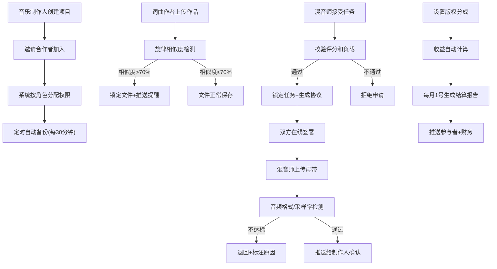

## 1. 产品概述

大型在线音乐制作协作平台，支持音乐制作人、混音师、词曲作者和平台管理员四种角色协同创作，提供项目管理、版权保护、混音协作、自动结算等全流程服务。

- 解决音乐制作行业协作效率低、版权追溯难、结算不透明等痛点
- 目标用户：独立音乐人、音乐制作团队、唱片公司、版权管理机构

## 2. 核心功能

### 2.1 用户角色

| 角色 | 注册方式 | 核心权限 |
|------|---------|---------|
| 音乐制作人 | 邮箱/手机号注册 | 创建项目、邀请合作者、设置版权分成、试听确认母带 |
| 混音师 | 邮箱/手机号注册+资质审核 | 接受混音任务、上传母带、查看任务评价 |
| 词曲作者 | 邮箱/手机号注册 | 上传歌词和旋律、查看版权收益 |
| 平台管理员 | 后台邀请 | 设置素材库权限、管理用户、查看平台数据 |

### 2.2 功能模块

1. **登录/注册页**：角色选择、身份认证、资质审核
2. **个人仪表盘**：任务概览、消息中心、项目进度、收益统计
3. **项目管理**：创建项目、成员邀请、权限分配、自动备份
4. **作品上传**：歌词/旋律上传、旋律相似度检测、重复提醒
5. **混音任务**：任务列表、资质校验、任务锁定、电子协议签署
6. **母带审核**：音频格式检测、采样率校验、试听确认
7. **版权结算**：分成比例设置、收益自动计算、月度结算报告
8. **管理后台**：素材库管理、权限配置、规则设置、数据统计
9. **消息中心**：实时通知、凭证下载、历史记录

### 2.3 页面详情

| 页面名称 | 模块名称 | 功能描述 |
|---------|---------|----------|
| 登录注册 | 角色选择 | 四种角色注册入口，混音师需上传资质证明 |
| 登录注册 | 认证流程 | 邮箱/验证码登录，支持第三方登录 |
| 个人仪表盘 | 概览卡片 | 待办任务、进行中项目、本月收益、未读消息 |
| 个人仪表盘 | 快捷操作 | 新建项目、上传作品、接受任务入口 |
| 项目列表 | 项目卡片 | 项目状态、成员列表、最近备份时间、操作按钮 |
| 项目详情 | 成员管理 | 邀请成员、角色分配、权限设置、移除成员 |
| 项目详情 | 文件管理 | 版本历史、备份记录、云端存储状态 |
| 作品上传 | 表单提交 | 歌词文本、旋律音频文件、作品信息填写 |
| 作品上传 | 检测结果 | 相似度百分比、匹配歌曲列表、锁定状态提示 |
| 混音任务 | 任务大厅 | 可接任务列表、筛选条件（风格、预算、截止日期） |
| 混音任务 | 任务详情 | 任务描述、作品预览、协议内容、在线签署 |
| 母带审核 | 上传表单 | 母带文件上传、格式/采样率自动检测 |
| 母带审核 | 审核列表 | 待审核、已通过、已退回状态，标注退回原因 |
| 版权结算 | 分成设置 | 按角色设置分成比例，支持自定义分配 |
| 版权结算 | 收益明细 | 播放量、下载量、总收益、各成员分成 |
| 版权结算 | 结算报告 | 月度报告生成、PDF下载、推送记录 |
| 管理后台 | 素材库管理 | 分类管理、访问权限设置、上传规则配置 |
| 管理后台 | 用户管理 | 用户列表、角色变更、账号状态管理 |
| 消息中心 | 通知列表 | 系统通知、任务提醒、审核结果、结算通知 |
| 消息中心 | 凭证管理 | 操作凭证下载、签署协议存档 |

## 3. 核心流程

### 3.1 项目创建与协作流程
音乐制作人创建项目 → 邀请词曲作者/混音师加入 → 系统根据角色分配编辑权限 → 每30分钟自动备份项目文件到云端

### 3.2 作品上传与查重流程
词曲作者上传歌词和旋律 → 系统自动对比歌曲库 → 相似度>70%则锁定文件 → 推送重复提醒给上传者和管理员

### 3.3 混音任务流程
混音师浏览任务大厅 → 选择任务 → 系统校验历史评分(≥4.0)和当前负载(≤3个任务) → 校验通过锁定任务 → 生成电子授权协议 → 双方在线签署 → 混音师开始工作 → 上传母带 → 系统检测音频格式(WAV/FLAC)和采样率(≥44.1kHz/24bit) → 不达标则退回并标注原因 → 通过后推送给制作人试听确认

### 3.4 版权结算流程
制作人设置版权分成比例 → 系统根据最终收益自动计算每首歌曲的版权分配 → 每月1号自动生成结算报告 → 推送给所有参与者和财务人员 → 支持下载PDF凭证

### 3.5 系统通知流程
文件上传 → 权限变更 → 任务分配 → 结算生成 → 系统推送实时消息 → 相关人员查看详情并下载凭证

## 4. 用户界面设计

### 4.1 设计风格

- **主色调**：深紫色 `#6C5CE7`（创意、艺术感）+ 霓虹青 `#00CEC9`（现代、科技感）
- **背景色**：深空灰 `#0F0F1A`（专业、沉浸感）+ 渐变层次
- **强调色**：珊瑚橙 `#FF7675`（警告、重要通知）+ 薄荷绿 `#00B894`（成功、通过）
- **字体**：展示字体 `Space Grotesk`（现代几何感）+ 正文字体 `Inter`（清晰易读）
- **布局风格**：暗黑模式、卡片式布局、玻璃拟态效果、动态渐变背景
- **图标风格**：线性图标 `lucide-react`，统一描边宽度2px，圆角图标

### 4.2 交互设计

- **按钮风格**：圆角12px，悬停时有发光效果，点击有微缩放动画
- **卡片样式**：毛玻璃背景 `backdrop-blur`，边框渐变，悬浮时上浮+阴影增强
- **导航栏**：左侧固定侧边栏，激活项有渐变背景和发光指示条
- **表单元素**：深色输入框，聚焦时有霓虹边框效果
- **数据展示**：图表使用渐变色填充，数字有滚动动画效果

### 4.3 页面设计概述

| 页面名称 | 模块名称 | UI元素 |
|---------|---------|--------|
| 登录注册 | 登录表单 | 渐变背景、浮动音符动画、玻璃拟态卡片、霓虹发光按钮 |
| 个人仪表盘 | 概览区域 | 动态数据卡片、环形进度图、波形动画背景 |
| 项目列表 | 项目网格 | 卡片悬停效果、状态标签、3D翻转显示详情 |
| 项目详情 | 时间线 | 垂直时间线、备份节点动画、成员头像悬浮效果 |
| 作品上传 | 上传区域 | 拖拽上传、波形实时预览、进度条渐变动画 |
| 混音任务 | 任务卡片 | 三维卡片、评分星星动画、负载进度条 |
| 母带审核 | 音频播放器 | 自定义波形播放器、频谱可视化、播放按钮动效 |
| 版权结算 | 数据图表 | 饼图/柱状图渐变填充、数字滚动动画、PDF下载按钮 |
| 管理后台 | 配置面板 | 开关切换动画、权限矩阵、规则表单 |
| 消息中心 | 通知列表 | 新消息呼吸灯效果、标记已读动画、凭证下载 |

### 4.4 响应式设计

- **桌面端**（1280px+）：完整侧边栏+内容区，多列布局
- **平板端**（768px-1279px）：可收起侧边栏，两列布局自适应
- **移动端**（<768px）：底部导航栏，单列布局，卡片堆叠

### 4.5 动效设计

- 页面加载：元素错落入场动画（staggered entrance）
- 数据更新：数字滚动、图表渐进式渲染
- 状态变化：平滑过渡动画，使用 `cubic-bezier(0.4, 0, 0.2, 1)` 缓动函数
- 悬浮效果：元素轻微上浮+阴影扩散+发光边框
- 通知推送：右上角滑入+轻微弹跳+呼吸灯提示
