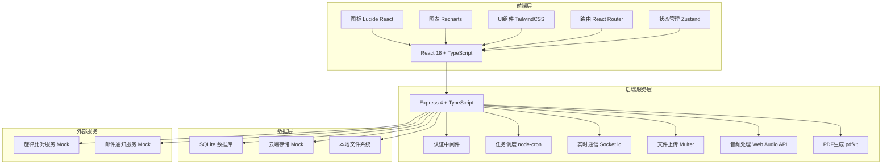
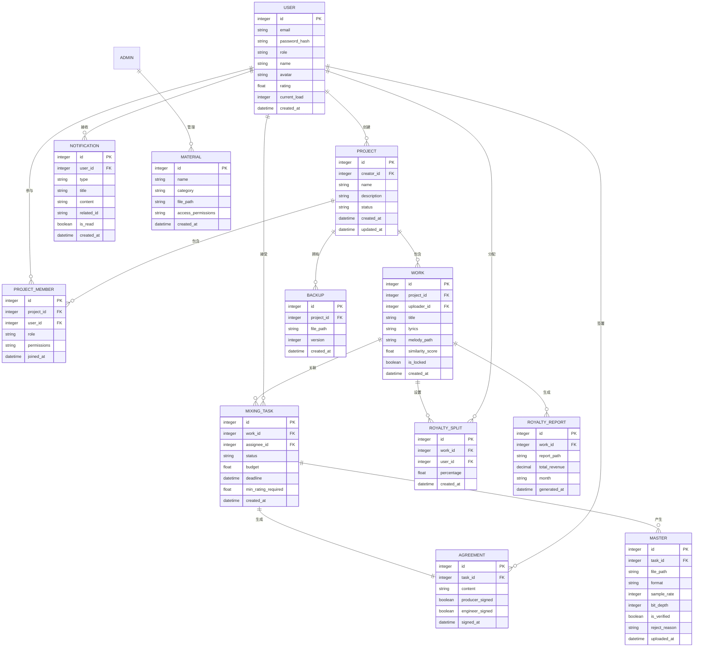
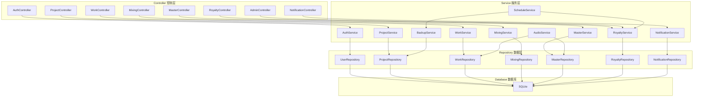

## 1. 架构设计



## 2. 技术描述

### 2.1 前端技术栈
- **框架**: React@18 + TypeScript + Vite@5
- **状态管理**: zustand@4
- **路由**: react-router-dom@6
- **样式**: tailwindcss@3
- **图表**: recharts@2
- **图标**: lucide-react@0.344
- **动画**: framer-motion@11
- **HTTP客户端**: axios@1.6

### 2.2 后端技术栈
- **框架**: Express@4 + TypeScript
- **认证**: jsonwebtoken@9 + bcrypt@5
- **任务调度**: node-cron@3
- **实时通信**: socket.io@4
- **文件上传**: multer@1.4
- **PDF生成**: pdfkit@0.14
- **数据库**: better-sqlite3@9
- **CORS**: cors@2.8

### 2.3 开发工具
- **包管理器**: npm
- **代码检查**: eslint@8
- **类型检查**: TypeScript@5
- **构建工具**: Vite@5

## 3. 路由定义

### 3.1 前端路由

| 路由路径 | 页面组件 | 权限要求 | 说明 |
|---------|---------|---------|------|
| `/login` | Login | 公开 | 登录注册页面 |
| `/register` | Register | 公开 | 角色选择注册 |
| `/dashboard` | Dashboard | 已登录 | 个人仪表盘 |
| `/projects` | ProjectList | 已登录 | 项目列表 |
| `/projects/:id` | ProjectDetail | 项目成员 | 项目详情 |
| `/projects/create` | ProjectCreate | 制作人 | 创建项目 |
| `/works` | WorkList | 已登录 | 作品列表 |
| `/works/upload` | WorkUpload | 词曲作者 | 上传作品 |
| `/works/:id` | WorkDetail | 已登录 | 作品详情 |
| `/mixing` | MixingTaskList | 已登录 | 混音任务大厅 |
| `/mixing/:id` | MixingTaskDetail | 已登录 | 混音任务详情 |
| `/mastering` | MasteringList | 已登录 | 母带审核 |
| `/mastering/upload/:taskId` | MasteringUpload | 混音师 | 上传母带 |
| `/royalty` | RoyaltyList | 已登录 | 版权结算 |
| `/royalty/:songId` | RoyaltyDetail | 已登录 | 结算详情 |
| `/admin/materials` | AdminMaterials | 管理员 | 素材库管理 |
| `/admin/users` | AdminUsers | 管理员 | 用户管理 |
| `/admin/settings` | AdminSettings | 管理员 | 系统设置 |
| `/messages` | MessageCenter | 已登录 | 消息中心 |
| `/profile` | UserProfile | 已登录 | 个人资料 |

### 3.2 后端API路由

| 方法 | 路由 | 模块 | 说明 |
|-----|------|------|------|
| POST | `/api/auth/login` | 认证 | 用户登录 |
| POST | `/api/auth/register` | 认证 | 用户注册 |
| GET | `/api/auth/me` | 认证 | 获取当前用户 |
| GET | `/api/users` | 用户 | 用户列表（管理员） |
| PUT | `/api/users/:id/role` | 用户 | 更改用户角色 |
| GET | `/api/projects` | 项目 | 获取项目列表 |
| POST | `/api/projects` | 项目 | 创建项目 |
| GET | `/api/projects/:id` | 项目 | 获取项目详情 |
| POST | `/api/projects/:id/members` | 项目 | 邀请成员 |
| PUT | `/api/projects/:id/members/:userId` | 项目 | 更新成员权限 |
| GET | `/api/projects/:id/backups` | 项目 | 获取备份记录 |
| POST | `/api/works` | 作品 | 上传作品 |
| GET | `/api/works` | 作品 | 获取作品列表 |
| GET | `/api/works/:id` | 作品 | 获取作品详情 |
| POST | `/api/works/:id/check-similarity` | 作品 | 检测旋律相似度 |
| GET | `/api/mixing-tasks` | 混音任务 | 获取混音任务列表 |
| POST | `/api/mixing-tasks` | 混音任务 | 创建混音任务 |
| POST | `/api/mixing-tasks/:id/accept` | 混音任务 | 接受任务 |
| POST | `/api/mixing-tasks/:id/sign` | 混音任务 | 签署协议 |
| POST | `/api/mastering` | 母带 | 上传母带 |
| POST | `/api/mastering/:id/verify` | 母带 | 检测音频格式 |
| POST | `/api/mastering/:id/confirm` | 母带 | 制作人确认 |
| GET | `/api/royalty` | 版税 | 获取版税列表 |
| PUT | `/api/royalty/:songId/split` | 版税 | 设置分成比例 |
| GET | `/api/royalty/reports` | 版税 | 获取结算报告 |
| POST | `/api/royalty/reports/generate` | 版税 | 生成结算报告 |
| GET | `/api/admin/materials` | 管理 | 素材库列表 |
| POST | `/api/admin/materials/permissions` | 管理 | 设置素材权限 |
| GET | `/api/notifications` | 通知 | 获取通知列表 |
| PUT | `/api/notifications/:id/read` | 通知 | 标记已读 |

## 4. 数据模型

### 4.1 ER图



### 4.2 TypeScript 类型定义

```typescript
// 用户类型
type UserRole = 'producer' | 'engineer' | 'songwriter' | 'admin';

interface User {
  id: number;
  email: string;
  name: string;
  role: UserRole;
  avatar: string;
  rating: number;
  currentLoad: number;
  createdAt: Date;
}

interface Project {
  id: number;
  creatorId: number;
  name: string;
  description: string;
  status: 'active' | 'completed' | 'archived';
  members: ProjectMember[];
  createdAt: Date;
  updatedAt: Date;
}

interface ProjectMember {
  id: number;
  projectId: number;
  userId: number;
  user: User;
  role: string;
  permissions: string[];
  joinedAt: Date;
}

interface Work {
  id: number;
  projectId: number;
  uploaderId: number;
  title: string;
  lyrics: string;
  melodyPath: string;
  similarityScore: number;
  isLocked: boolean;
  createdAt: Date;
}

interface MixingTask {
  id: number;
  workId: number;
  work: Work;
  assigneeId: number | null;
  status: 'pending' | 'assigned' | 'in_progress' | 'completed' | 'rejected';
  budget: number;
  deadline: Date;
  minRatingRequired: number;
  createdAt: Date;
}

interface Master {
  id: number;
  taskId: number;
  filePath: string;
  format: string;
  sampleRate: number;
  bitDepth: number;
  isVerified: boolean;
  rejectReason: string | null;
  uploadedAt: Date;
}

interface RoyaltySplit {
  id: number;
  workId: number;
  userId: number;
  user: User;
  percentage: number;
  createdAt: Date;
}

interface RoyaltyReport {
  id: number;
  workId: number;
  work: Work;
  reportPath: string;
  totalRevenue: number;
  month: string;
  generatedAt: Date;
}

interface Notification {
  id: number;
  userId: number;
  type: 'upload' | 'permission' | 'task' | 'settlement' | 'system';
  title: string;
  content: string;
  relatedId: string;
  isRead: boolean;
  createdAt: Date;
}

interface Material {
  id: number;
  name: string;
  category: string;
  filePath: string;
  accessPermissions: string[];
  createdAt: Date;
}
```

### 4.3 数据库初始化SQL

```sql
-- 用户表
CREATE TABLE users (
  id INTEGER PRIMARY KEY AUTOINCREMENT,
  email VARCHAR(255) UNIQUE NOT NULL,
  password_hash VARCHAR(255) NOT NULL,
  name VARCHAR(100) NOT NULL,
  role VARCHAR(20) NOT NULL CHECK (role IN ('producer', 'engineer', 'songwriter', 'admin')),
  avatar VARCHAR(255),
  rating DECIMAL(3,2) DEFAULT 0,
  current_load INTEGER DEFAULT 0,
  created_at DATETIME DEFAULT CURRENT_TIMESTAMP
);

-- 项目表
CREATE TABLE projects (
  id INTEGER PRIMARY KEY AUTOINCREMENT,
  creator_id INTEGER NOT NULL,
  name VARCHAR(200) NOT NULL,
  description TEXT,
  status VARCHAR(20) DEFAULT 'active',
  created_at DATETIME DEFAULT CURRENT_TIMESTAMP,
  updated_at DATETIME DEFAULT CURRENT_TIMESTAMP,
  FOREIGN KEY (creator_id) REFERENCES users(id)
);

-- 项目成员表
CREATE TABLE project_members (
  id INTEGER PRIMARY KEY AUTOINCREMENT,
  project_id INTEGER NOT NULL,
  user_id INTEGER NOT NULL,
  role VARCHAR(50) NOT NULL,
  permissions TEXT NOT NULL,
  joined_at DATETIME DEFAULT CURRENT_TIMESTAMP,
  FOREIGN KEY (project_id) REFERENCES projects(id),
  FOREIGN KEY (user_id) REFERENCES users(id)
);

-- 备份表
CREATE TABLE backups (
  id INTEGER PRIMARY KEY AUTOINCREMENT,
  project_id INTEGER NOT NULL,
  file_path VARCHAR(500) NOT NULL,
  version INTEGER NOT NULL,
  created_at DATETIME DEFAULT CURRENT_TIMESTAMP,
  FOREIGN KEY (project_id) REFERENCES projects(id)
);

-- 作品表
CREATE TABLE works (
  id INTEGER PRIMARY KEY AUTOINCREMENT,
  project_id INTEGER NOT NULL,
  uploader_id INTEGER NOT NULL,
  title VARCHAR(200) NOT NULL,
  lyrics TEXT,
  melody_path VARCHAR(500),
  similarity_score DECIMAL(5,2) DEFAULT 0,
  is_locked BOOLEAN DEFAULT 0,
  created_at DATETIME DEFAULT CURRENT_TIMESTAMP,
  FOREIGN KEY (project_id) REFERENCES projects(id),
  FOREIGN KEY (uploader_id) REFERENCES users(id)
);

-- 混音任务表
CREATE TABLE mixing_tasks (
  id INTEGER PRIMARY KEY AUTOINCREMENT,
  work_id INTEGER NOT NULL,
  assignee_id INTEGER,
  status VARCHAR(20) DEFAULT 'pending',
  budget DECIMAL(10,2) NOT NULL,
  deadline DATETIME,
  min_rating_required DECIMAL(3,2) DEFAULT 4.0,
  created_at DATETIME DEFAULT CURRENT_TIMESTAMP,
  FOREIGN KEY (work_id) REFERENCES works(id),
  FOREIGN KEY (assignee_id) REFERENCES users(id)
);

-- 协议表
CREATE TABLE agreements (
  id INTEGER PRIMARY KEY AUTOINCREMENT,
  task_id INTEGER NOT NULL,
  content TEXT NOT NULL,
  producer_signed BOOLEAN DEFAULT 0,
  engineer_signed BOOLEAN DEFAULT 0,
  signed_at DATETIME,
  FOREIGN KEY (task_id) REFERENCES mixing_tasks(id)
);

-- 母带表
CREATE TABLE masters (
  id INTEGER PRIMARY KEY AUTOINCREMENT,
  task_id INTEGER NOT NULL,
  file_path VARCHAR(500) NOT NULL,
  format VARCHAR(10) NOT NULL,
  sample_rate INTEGER NOT NULL,
  bit_depth INTEGER NOT NULL,
  is_verified BOOLEAN DEFAULT 0,
  reject_reason TEXT,
  uploaded_at DATETIME DEFAULT CURRENT_TIMESTAMP,
  FOREIGN KEY (task_id) REFERENCES mixing_tasks(id)
);

-- 版权分成表
CREATE TABLE royalty_splits (
  id INTEGER PRIMARY KEY AUTOINCREMENT,
  work_id INTEGER NOT NULL,
  user_id INTEGER NOT NULL,
  percentage DECIMAL(5,2) NOT NULL,
  created_at DATETIME DEFAULT CURRENT_TIMESTAMP,
  FOREIGN KEY (work_id) REFERENCES works(id),
  FOREIGN KEY (user_id) REFERENCES users(id)
);

-- 结算报告表
CREATE TABLE royalty_reports (
  id INTEGER PRIMARY KEY AUTOINCREMENT,
  work_id INTEGER NOT NULL,
  report_path VARCHAR(500) NOT NULL,
  total_revenue DECIMAL(12,2) NOT NULL,
  month VARCHAR(7) NOT NULL,
  generated_at DATETIME DEFAULT CURRENT_TIMESTAMP,
  FOREIGN KEY (work_id) REFERENCES works(id)
);

-- 通知表
CREATE TABLE notifications (
  id INTEGER PRIMARY KEY AUTOINCREMENT,
  user_id INTEGER NOT NULL,
  type VARCHAR(20) NOT NULL,
  title VARCHAR(200) NOT NULL,
  content TEXT NOT NULL,
  related_id VARCHAR(100),
  is_read BOOLEAN DEFAULT 0,
  created_at DATETIME DEFAULT CURRENT_TIMESTAMP,
  FOREIGN KEY (user_id) REFERENCES users(id)
);

-- 素材表
CREATE TABLE materials (
  id INTEGER PRIMARY KEY AUTOINCREMENT,
  name VARCHAR(200) NOT NULL,
  category VARCHAR(100) NOT NULL,
  file_path VARCHAR(500) NOT NULL,
  access_permissions TEXT NOT NULL,
  created_at DATETIME DEFAULT CURRENT_TIMESTAMP
);

-- 初始数据
INSERT INTO users (email, password_hash, name, role, avatar, rating) VALUES
('admin@music.com', '$2b$10$hash', '系统管理员', 'admin', '/avatars/admin.png', 5.0),
('producer@music.com', '$2b$10$hash', '张制作人', 'producer', '/avatars/producer.png', 4.8),
('engineer@music.com', '$2b$10$hash', '李混音师', 'engineer', '/avatars/engineer.png', 4.5),
('songwriter@music.com', '$2b$10$hash', '王词曲', 'songwriter', '/avatars/songwriter.png', 4.2);
```

## 5. 后端架构



## 6. 核心业务逻辑

### 6.1 定时任务
- **自动备份**: 每30分钟执行一次，备份所有活跃项目文件
- **月度结算**: 每月1号凌晨2:00执行，生成所有歌曲的结算报告
- **通知清理**: 每天凌晨1:00执行，清理30天前的已读通知

### 6.2 权限矩阵

| 操作 | 制作人 | 混音师 | 词曲作者 | 管理员 |
|-----|-------|--------|----------|-------|
| 创建项目 | ✅ | ❌ | ❌ | ✅ |
| 邀请成员 | ✅ | ❌ | ❌ | ✅ |
| 上传歌词旋律 | ❌ | ❌ | ✅ | ✅ |
| 接受混音任务 | ❌ | ✅ | ❌ | ❌ |
| 上传母带 | ❌ | ✅ | ❌ | ❌ |
| 确认母带 | ✅ | ❌ | ❌ | ✅ |
| 设置分成比例 | ✅ | ❌ | ❌ | ✅ |
| 查看结算报告 | ✅ | ✅ | ✅ | ✅ |
| 管理素材库 | ❌ | ❌ | ❌ | ✅ |
| 管理用户 | ❌ | ❌ | ❌ | ✅ |

### 6.3 音频检测规则
- **支持格式**: WAV, FLAC
- **采样率要求**: ≥ 44.1kHz
- **位深度要求**: ≥ 24bit
- **文件大小限制**: ≤ 500MB

### 6.4 旋律相似度检测
- 使用 Mock 服务模拟相似度计算
- 相似度 > 70% 自动锁定文件
- 推送通知给上传者和管理员
